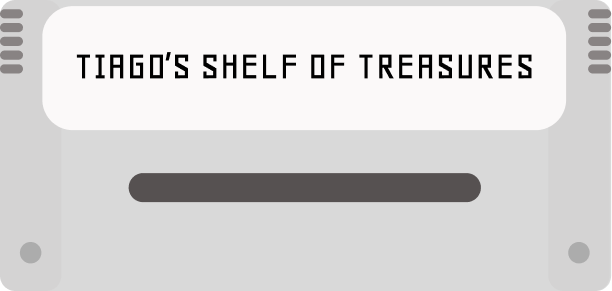
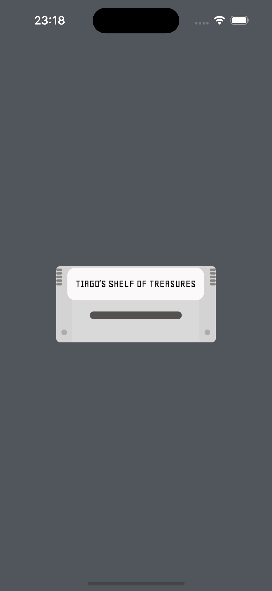
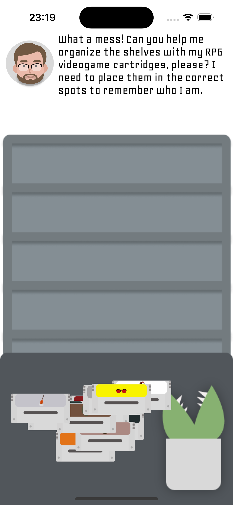
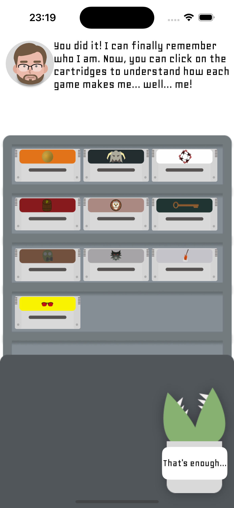
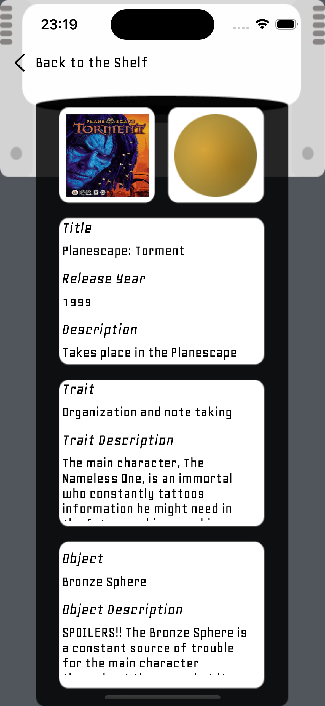
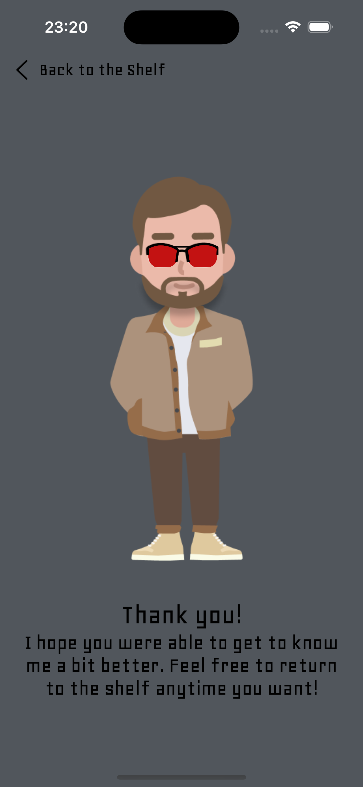

<h1 align="center">
    
</h1>

  <i align="center">A personal introduction through <b>RPG game cartridges</b> on a shelf</i>

  
  
  
  

## Introduction

Tiago's Shelf of Treasures is an **iOS app** built with SwiftUI for the Apple Developer Academy as a creative self-introduction. Help Tiago organize 10 **RPG game cartridges** scattered across a messy shelf — each one represents a piece of his personality, and tapping a placed cartridge reveals why that game made him who he is.

## Screenshots

Screenshots

 

    
&nbsp;
    

    
&nbsp;
    

    

## Development

- **Architecture & Patterns**: SwiftUI views driven by `@State` properties; a `SoundManager` singleton wraps `AVAudioPlayer` to decouple sound playback from views.
- **Frameworks**: SwiftUI for all UI and `DragGesture`-based drag-and-drop; AVKit for cartridge snap, lock, and button sound effects; custom Geo typeface loaded as bundled `.ttf` resources.

The main challenge was locking each cartridge in place once snapped to its correct shelf slot — solved by tracking placed cartridges in a `@State` array and constraining `DragGesture` offsets after a successful drop.

## Resources & Credits

- **Figma**: UI design and asset creation.
- **Custom Font**: [Geo](https://fonts.google.com/specimen/Geo) by Ben Weiner — bundled as `Geo-Regular.ttf` and `Geo-Italic.ttf`.
- **Sound Effects**: `cartridge.mp3`, `door-lock.mp3`, `lock.mp3`, `button.mp3` — used for interactive feedback throughout the app.

## License

Tiago's Shelf of Treasures is available under the [MIT License](./LICENSE).
